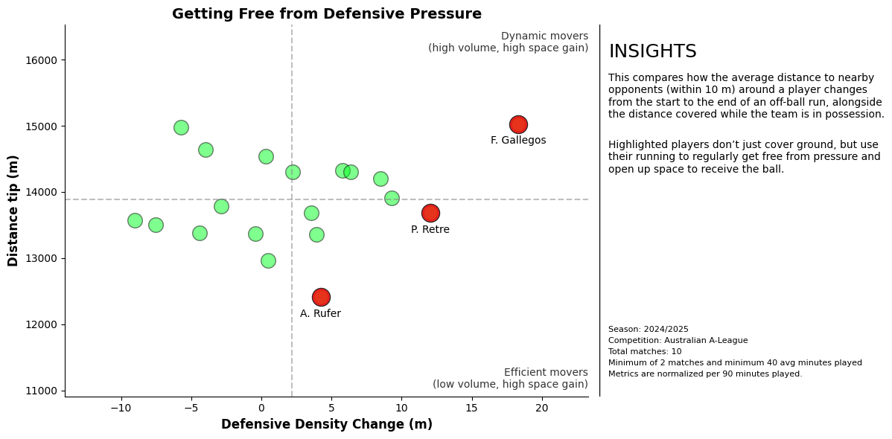

# SkillCorner X PySport Analytics Cup
This repository contains the submission template for the SkillCorner X PySport Analytics Cup **Research Track**. 
Your submission for the **Research Track** should be on the `main` branch of your own fork of this repository.

Find the Analytics Cup [**dataset**](https://github.com/SkillCorner/opendata/tree/master/data) and [**tutorials**](https://github.com/SkillCorner/opendata/tree/master/resources) on the [**SkillCorner Open Data Repository**](https://github.com/SkillCorner/opendata).

## Submitting
Make sure your `main` branch contains:
1. A single Jupyter Notebook in the root of this repository called `submission.ipynb`
    - This Juypter Notebook can not contain more than 2000 words.
    - All other code should also be contained in this repository, but should be imported into the notebook from the `src` folder.
2. An abstract of maximum 500 words that follows the **Research Track Abstract Template**.
    - The abstract can contain a maximum of 2 figures, 2 tables or 1 figure and 1 table.
3. Submit your GitHub repository on the [Analytics Cup Pretalx page](https://pretalx.pysport.org)

Finally:
- Make sure your GitHub repository does **not** contain big data files. The tracking data should be loaded directly from the [Analytics Cup Data GitHub Repository](https://github.com/SkillCorner/opendata).For more information on how to load the data directly from GitHub please see this [Jupyter Notebook](https://github.com/SkillCorner/opendata/blob/master/resources/getting-started-skc-tracking-kloppy.ipynb).
- Make sure the `submission.ipynb` notebook runs on a clean environment.

_⚠️ Not adhering to these submission rules and the [**Analytics Cup Rules**](https://pysport.org/analytics-cup/rules) may result in a point deduction or disqualification._

---

## Research Track Abstract Template (max. 500 words)
#### Introduction

Football analysis has traditionally focused on on-ball actions, despite players performing over **450** off-ball runs per 90 minutes on average. These movements create space, disrupt defensive structures, and shape attacking sequences, even when they are not rewarded with the ball. This project focuses on midfielders and evaluates the **quality** of their off-ball movement rather than its volume. By introducing new spatial metrics and combining them with existing ones, the project provides a practical framework for scouting, tactical analysis, and player profiling.

#### Methods

This project combines tracking, event, and physical aggregation data. First, an overview analysis is conducted to highlight the importance of off-ball movement in football. Two custom metrics are then introduced. **Defensive density change** measures how much freedom players gain through their runs by comparing the average distance to nearby defenders, capturing their ability to get free and support ball circulation and attacking play. The second metric, **space created**, quantifies the space generated for teammates by comparing pitch control at the start of a run with the average control in a short window at the end of the run. This metric is applied only to build-up runs, where the space left behind is tactically meaningful. Together with xThreat and distance covered, these metrics are used in radar plots to profile players and evaluate run quality rather than volume.

#### Results

Figure 1 compares distance covered per 90 minutes during team possession with defensive density change per 90 minutes. This visualization helps identify players who become free efficiently with minimal movement, as well as players who cover more ground but struggle to reduce defensive pressure.

Figure 2 compares two players using radar plots that combine the previously described metrics. On one hand, R. Teague covers relatively little distancee but he achieves to be way above the average in space created in build up runs and getting free in progression runs while also contributing to xThreat. This shows that his impact comes from smart, timely movement rather than the quantity of runs. In contrast, L. Verstraete' radar plot reveals a different picture in terms of run quality. He ranks low on the metrics while being one of the players who covers the most distance. This suggests a highly dynamic playing style that relies on constant movement, but one that does not consistently translate into space creation or defensive density change.

#### Conclusion

This project demonstrates that off-ball movement can be meaningfully measured. Metrics like defensive density change and space created reveal how players influence the game without the ball. Combined with visualizations and player profiling, these metrics help identify players whose movements consistently add value to their team.

On future improvements, the space created metric could be refined by incorporating player speed, direction, and positional uncertainty. Additionally, analyzing whether teammates occupy the created spaces and assessing their value via models like EPV would quantify real impact. Finally, clustering midfielders by these metrics could support scouting, talent identification, and player comparisons.

**Gabriel Gausachs**
**SkillCorner × PySport Hackathon**  
**2025**